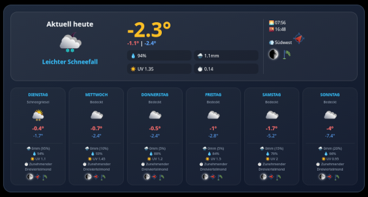

# Open-Meteo Weather Widget for ioBroker VIS2


A modern, elegant, simple and highly informative weather widget for ioBroker **VIS2**. This script processes data from the **[Open-Meteo Weather Adapter](https://github.com/H5N1v2/ioBroker.open-meteo-weather)** and generates a responsive HTML widget providing current weather data as well as a 7-day forecast.



## ✨ Features

* **Real-time Display:** Current temperature, weather condition (text & icon), humidity, rain amount, and UV index.
* **7-Day Forecast:** Compact overview of the coming days, including min/max temperatures and precipitation probability.
* **Astronomical Data:** Display of sunrise, sunset, and moon phases (icon & text).
* **Wind Info:** Wind direction and gust visualization using icons.
* **Multi-language:** Automatic detection of the ioBroker system language (supports 11 languages, including Ukrainian and Chinese).
* **Modern Design:** Dark glass-morphism design with gradients, optimized for modern dashboards.

---

## 🚀 Installation & Configuration

### 1. Prerequisites
* **Important:** This widget strictly requires the installed and configured **[Open-Meteo Weather Adapter](https://github.com/H5N1v2/ioBroker.open-meteo-weather)**. The script cannot retrieve weather data without this specific adapter.
* The **JavaScript Adapter** (Script Engine) must be installed in ioBroker.
* **Adapter Settings:** In the Open-Meteo Weather adapter settings, the forecast must be set to at least 7 days. Note that the widget displays a maximum of 7 days; if fewer days are configured, the remaining slots will stay empty.

### 2. Create Script
1.  Create a new script in the ioBroker JavaScript adapter.
2.  Copy the entire code of the weather widget into the script.
3.  **Adjust Location:** Change the `locationName` in line 4 to match the name of your location as defined in the Open-Meteo adapter:
    ```javascript
    const locationName = 'locationName'; // <-- Enter your location name here
    ```

### 3. Start Script
After saving and starting the script, the datapoint `0_userdata.0.Wetter_Widget_HTML` will be created automatically. The script updates the content every 5 minutes or immediately upon temperature changes.

---

## 🖼️ Integration in VIS2

Integration into VIS2 is done via a standard HTML widget:

1.  Open the **VIS2 Editor**.
2.  Select the **"HTML"** widget (Standard Widget) and place it on your view.
3.  Enter the following binding into the **HTML** field in the property panel:
    ```text
    {0_userdata.0.Wetter_Widget_HTML}
    ```
4.  Adjust the size of the widget (a width of approx. 600px - 800px is recommended for the forecast view).

---

## 🛠️ Adjustments

The design can be adjusted directly within the script in the `<style>` section. You can modify colors, spacing, or font sizes according to your preferences.

### Log Outputs
* `Data point ... has been newly created.`: Appears only during the initial setup.
* `Weather widget: HTML successfully generated.`: Confirmation of a successful update in the ioBroker log.

---
## Change Log

### v0.0.1 - 2026-01-26

* 0.0.1 Initial Release

## 📄 License
This project is licensed under the MIT License.

---
